# OpenClaw MCP Integration Plugin

**Model Context Protocol (MCP) integration for OpenClaw** - Connect to MCP servers and use their tools seamlessly within OpenClaw.

## 🎯 Overview

This plugin enables OpenClaw to connect to any MCP (Model Context Protocol) server and expose its tools to AI agents. It implements the MCP Streamable HTTP transport specification and provides a unified interface for calling external MCP tools.

> ✅ **Real Working Example:** See [REAL_EXAMPLE_KR_LEGAL.md](docs/REAL_EXAMPLE_KR_LEGAL.md) for a complete, tested configuration with kr-legal-search (no API key required!).

### Key Features

✅ **HTTP/SSE Transport** - Full support for MCP Streamable HTTP with Server-Sent Events  
✅ **Dynamic Tool Discovery** - Automatically discovers and registers tools from MCP servers  
✅ **Multi-Server Support** - Connect to multiple MCP servers simultaneously  
✅ **Unified Interface** - All MCP tools accessible through a single `mcp` tool  
✅ **Error Handling** - Robust error handling and logging  

## 📋 Prerequisites

- **OpenClaw**: Version 2026.1.0 or higher
- **Node.js**: 18.0.0 or higher
- **MCP Server**: Any MCP-compliant server with HTTP transport

## 🚀 Installation

### Method 1: Via OpenClaw Extensions

```bash
# Clone into OpenClaw extensions directory
cd ~/.openclaw/extensions/
git clone https://github.com/yourorg/mcp-integration.git

# Install dependencies
cd mcp-integration
npm install

# Restart OpenClaw
openclaw gateway restart
```

### Method 2: Manual Installation

```bash
# Clone repository
git clone https://github.com/yourorg/mcp-integration.git
cd mcp-integration

# Install dependencies
npm install

# Link to OpenClaw
ln -s $(pwd) ~/.openclaw/extensions/mcp-integration

# Restart OpenClaw
openclaw gateway restart
```

## ⚙️ Configuration

### Basic Configuration

Add to `~/.openclaw/openclaw.json`:

```json
{
  "plugins": {
    "entries": {
      "mcp-integration": {
        "enabled": true,
        "config": {
          "enabled": true,
          "servers": {
            "example-server": {
              "enabled": true,
              "transport": "http",
              "url": "http://localhost:3000/mcp"
            }
          }
        }
      }
    }
  }
}
```

### Configuration Schema

```typescript
{
  enabled: boolean;              // Enable/disable plugin (default: true)
  servers: {
    [serverName: string]: {
      enabled: boolean;          // Enable/disable this server (default: true)
      transport: "http";         // Transport type (currently only http supported)
      url: string;               // Server URL (e.g., "http://localhost:3000/mcp")
    }
  }
}
```

### Multiple Servers Example

```json
{
  "plugins": {
    "entries": {
      "mcp-integration": {
        "enabled": true,
        "config": {
          "enabled": true,
          "servers": {
            "kr-legal": {
              "enabled": true,
              "transport": "http",
              "url": "http://localhost:3000/mcp"
            },
            "database": {
              "enabled": true,
              "transport": "http",
              "url": "http://localhost:3001/mcp"
            },
            "weather": {
              "enabled": true,
              "transport": "http",
              "url": "http://localhost:3002/mcp"
            }
          }
        }
      }
    }
  }
}
```

## 🛠️ Usage

### The `mcp` Tool

Once configured, the plugin registers a single `mcp` tool that provides access to all connected MCP servers.

#### List Available Tools

**In OpenClaw chat:**
```
User: List all MCP tools

AI: I'll check what MCP tools are available.

[Uses tool: mcp with action=list]

Available MCP tools:
- kr-legal:search_statute - Search Korean statutes
- kr-legal:search_case_law - Search court decisions
- database:query - Execute database query
- weather:get_forecast - Get weather forecast
```

**Tool call:**
```json
{
  "tool": "mcp",
  "args": {
    "action": "list"
  }
}
```

**Response:**
```json
[
  {
    "id": "kr-legal:search_statute",
    "server": "kr-legal",
    "name": "search_statute",
    "description": "Search Korean statutes and regulations",
    "inputSchema": {
      "type": "object",
      "properties": {
        "query": { "type": "string" },
        "limit": { "type": "number" }
      },
      "required": ["query"]
    }
  },
  {
    "id": "database:query",
    "server": "database",
    "name": "query",
    "description": "Execute SQL query",
    "inputSchema": {
      "type": "object",
      "properties": {
        "sql": { "type": "string" }
      },
      "required": ["sql"]
    }
  }
]
```

#### Call an MCP Tool

**In OpenClaw chat:**
```
User: Search for Korean labor law

AI: I'll search Korean legal statutes for labor law.

[Uses tool: mcp with action=call, server=kr-legal, tool=search_statute]

Found 15 statutes related to labor law...
```

**Tool call:**
```json
{
  "tool": "mcp",
  "args": {
    "action": "call",
    "server": "kr-legal",
    "tool": "search_statute",
    "args": {
      "query": "노동법",
      "limit": 5
    }
  }
}
```

**Response:**
```json
{
  "content": [
    {
      "type": "text",
      "text": "{\"results\":[{\"title\":\"근로기준법\",\"statute_id\":\"0065\",...}]}"
    }
  ]
}
```

## 🏗️ Architecture

### Component Diagram

```
┌─────────────────────────────────────────────┐
│           OpenClaw Core                     │
│  ┌───────────────────────────────────────┐  │
│  │  Agent (main/admin/chat)              │  │
│  └────────────────┬──────────────────────┘  │
│                   │                          │
│                   ▼                          │
│  ┌───────────────────────────────────────┐  │
│  │  Tool System                          │  │
│  │  - Calls mcp tool                     │  │
│  └────────────────┬──────────────────────┘  │
└───────────────────┼──────────────────────────┘
                    │
                    ▼
┌─────────────────────────────────────────────┐
│      MCP Integration Plugin                 │
│  ┌───────────────────────────────────────┐  │
│  │  MCPManager                           │  │
│  │  - Manages connections                │  │
│  │  - Routes tool calls                  │  │
│  │  - Lists available tools              │  │
│  └────────────┬──────────────────────────┘  │
│               │                             │
│  ┌────────────┴──────────────┐              │
│  │                           │              │
│  ▼                           ▼              │
│  Client 1                  Client 2         │
│  (kr-legal)                (database)       │
└──┼────────────────────────────┼─────────────┘
   │                            │
   ▼                            ▼
┌─────────────┐          ┌─────────────┐
│ MCP Server  │          │ MCP Server  │
│ (HTTP/SSE)  │          │ (HTTP/SSE)  │
└─────────────┘          └─────────────┘
```

### Class Structure

```typescript
class MCPManager {
  clients: Map<string, { client, transport }>;
  tools: Map<string, { server, tool, client }>;
  
  async connectServer(name: string, config: ServerConfig): Promise<Tool[]>;
  async callTool(serverName: string, toolName: string, args: any): Promise<any>;
  listTools(): ToolInfo[];
  async disconnect(): Promise<void>;
}

class StreamableHTTPClientTransport {
  constructor(url: string, options?: TransportOptions);
  
  async start(): Promise<void>;
  async send(message: JSONRPCRequest): Promise<JSONRPCResponse>;
  async close(): Promise<void>;
  
  onmessage?: (message: JSONRPCMessage) => void;
  onerror?: (error: Error) => void;
  onclose?: () => void;
}
```

## 🔄 Request Flow

### Tool Call Sequence

```mermaid
sequenceDiagram
    participant User
    participant Agent
    participant ToolSystem
    participant MCPPlugin
    participant MCPClient
    participant MCPServer

    User->>Agent: "Search for labor law"
    Agent->>ToolSystem: mcp(action=call, server=kr-legal, tool=search_statute)
    ToolSystem->>MCPPlugin: execute(params)
    MCPPlugin->>MCPClient: callTool(search_statute, {query: "노동법"})
    MCPClient->>MCPServer: POST /mcp {method: tools/call, params: {...}}
    MCPServer-->>MCPClient: {result: {...}}
    MCPClient-->>MCPPlugin: {content: [...]}
    MCPPlugin-->>ToolSystem: {content: [...]}
    ToolSystem-->>Agent: Tool result
    Agent-->>User: "Found 15 statutes..."
```



## 📊 HTTP Transport Implementation

### Streamable HTTP Specification

This plugin implements the MCP Streamable HTTP transport:

**POST Request** (Client to Server):
```http
POST /mcp HTTP/1.1
Content-Type: application/json
mcp-session-id: session-123

{
  "jsonrpc": "2.0",
  "id": 1,
  "method": "tools/call",
  "params": {
    "name": "search_statute",
    "arguments": {"query": "민법"}
  }
}
```

**GET SSE Stream** (Server to Client, optional):
```http
GET /mcp HTTP/1.1
Accept: text/event-stream
mcp-session-id: session-123

# Server can send:
event: message
data: {"jsonrpc":"2.0","id":1,"result":{...}}
```

### Session Management

- Session ID is generated on first connection
- Persisted across requests via `mcp-session-id` header
- Allows server to maintain state

## 🔧 Development

### Project Structure

```
mcp-integration/
├── src/
│   ├── index.js             # Main plugin entry point
│   └── http-transport.js    # HTTP/SSE transport implementation
├── config/
│   └── openclaw.plugin.json # Plugin metadata and config schema
├── package.json             # npm dependencies
└── README.md                # This file
```

### Key Files

**index.js**
- Exports OpenClaw plugin registration function
- Implements MCPManager class
- Registers the `mcp` tool
- Handles server connections and tool routing

**http-transport.js**
- Implements `StreamableHTTPClientTransport` class
- Handles HTTP POST requests
- Manages SSE stream for server messages
- Implements MCP transport interface

**openclaw.plugin.json**
- Plugin metadata (id, name, version)
- Configuration schema
- OpenClaw version requirements

### Adding Debug Logging

Enable debug mode in transport:

```javascript
const transport = new StreamableHTTPClientTransport(url, { debug: true });
```

This logs:
- Connection establishment
- Request/response details
- SSE stream events
- Error conditions

## 🧪 Testing

### Test Connection

```bash
# Start a test MCP server
node test-server.js

# In OpenClaw chat
User: List MCP tools

AI: [Shows available tools from test server]
```

### Manual Tool Call

```bash
# Using OpenClaw CLI (if available)
openclaw tool call mcp '{"action":"list"}'

openclaw tool call mcp '{
  "action": "call",
  "server": "test",
  "tool": "echo",
  "args": {"message": "Hello MCP!"}
}'
```

### Test MCP Server

```javascript
// test-server.js
import express from 'express';

const app = express();
app.use(express.json());

app.post('/mcp', (req, res) => {
  const { method, params } = req.body;
  
  if (method === 'tools/list') {
    res.json({
      jsonrpc: '2.0',
      id: req.body.id,
      result: {
        tools: [
          {
            name: 'echo',
            description: 'Echo back a message',
            inputSchema: {
              type: 'object',
              properties: {
                message: { type: 'string' }
              }
            }
          }
        ]
      }
    });
  } else if (method === 'tools/call') {
    res.json({
      jsonrpc: '2.0',
      id: req.body.id,
      result: {
        content: [
          { type: 'text', text: `Echo: ${params.arguments.message}` }
        ]
      }
    });
  }
});

app.listen(3000, () => console.log('Test MCP server on :3000'));
```

## 🐛 Troubleshooting

### Plugin Not Loading

**Check:**
```bash
openclaw status
# Look for plugin errors

openclaw logs | grep MCP
# Check MCP-specific logs
```

**Solution:**
```bash
# Verify plugin directory
ls -la ~/.openclaw/extensions/mcp-integration/

# Check dependencies
cd ~/.openclaw/extensions/mcp-integration/
npm install

# Restart gateway
openclaw gateway restart
```

### Server Connection Failed

**Error:**
```
[MCP] Failed to connect to kr-legal: fetch failed
```

**Solutions:**

1. **Check server is running:**
   ```bash
   curl http://localhost:3000/mcp
   ```

2. **Verify URL in config:**
   ```bash
   cat ~/.openclaw/openclaw.json | jq '.plugins.entries["mcp-integration"].config.servers'
   ```

3. **Check firewall:**
   ```bash
   # Allow local connections
   sudo ufw allow from 127.0.0.1
   ```

### Tool Not Found

**Error:**
```
Error: Tool not found: kr-legal:search_statute
```

**Solutions:**

1. **List available tools:**
   ```json
   {"tool": "mcp", "args": {"action": "list"}}
   ```

2. **Check server connection:**
   ```bash
   openclaw logs | grep "Connected to kr-legal"
   ```

3. **Reconnect servers:**
   ```bash
   openclaw gateway restart
   ```

## 📚 Examples

### Example 1: Weather Service

**Configuration:**
```json
{
  "servers": {
    "weather": {
      "enabled": true,
      "transport": "http",
      "url": "http://localhost:3000/mcp"
    }
  }
}
```

**Usage:**
```
User: What's the weather in Seoul?

AI: I'll check the weather forecast.

[Uses: mcp(action=call, server=weather, tool=get_forecast, args={city: "Seoul"})]

The weather in Seoul is currently 15°C, partly cloudy...
```

### Example 2: Database Query

**Configuration:**
```json
{
  "servers": {
    "database": {
      "enabled": true,
      "transport": "http",
      "url": "http://localhost:3001/mcp"
    }
  }
}
```

**Usage:**
```
User: Show me recent orders from the database

AI: I'll query the database for recent orders.

[Uses: mcp(action=call, server=database, tool=query, args={
  sql: "SELECT * FROM orders ORDER BY created_at DESC LIMIT 10"
})]

Here are the 10 most recent orders...
```

## 🔒 Security Considerations

### Server Validation

- Only connect to trusted MCP servers
- Use HTTPS for production deployments
- Validate server certificates

### Tool Permissions

Consider limiting tool access per agent:
```json
{
  "agents": {
    "main": {
      "tools": {
        "allowlist": ["mcp"]
      }
    },
    "chat": {
      "tools": {
        "denylist": ["mcp"]  // Disable MCP in public chat
      }
    }
  }
}
```

### Input Validation

All tool arguments are passed through to MCP servers. Ensure:
- MCP servers validate inputs
- Sensitive operations require confirmation
- Rate limiting is implemented

## 🚀 Future Enhancements

- [ ] stdio transport support
- [ ] Resource support (MCP resources)
- [ ] Prompt support (MCP prompts)
- [ ] Tool caching
- [ ] Connection pooling
- [ ] Retry logic
- [ ] Health checks
- [ ] Metrics and monitoring

## 📖 References

- [Model Context Protocol Specification](https://spec.modelcontextprotocol.io/)
- [MCP SDK Documentation](https://github.com/modelcontextprotocol/typescript-sdk)
- [OpenClaw Plugin Development](https://docs.openclaw.ai/plugins)

## 📄 License

MIT

## 🤝 Contributing

Contributions welcome! Please:

1. Fork the repository
2. Create a feature branch
3. Make your changes
4. Add tests if applicable
5. Submit a pull request

## 💬 Support

- **Issues**: [GitHub Issues](https://github.com/yourorg/mcp-integration/issues)
- **Discord**: OpenClaw Community #plugins
- **Email**: support@openclaw.ai

---

**Version:** 0.1.0  
**Last Updated:** 2026-02-01  
**Author:** Lob 🦞
